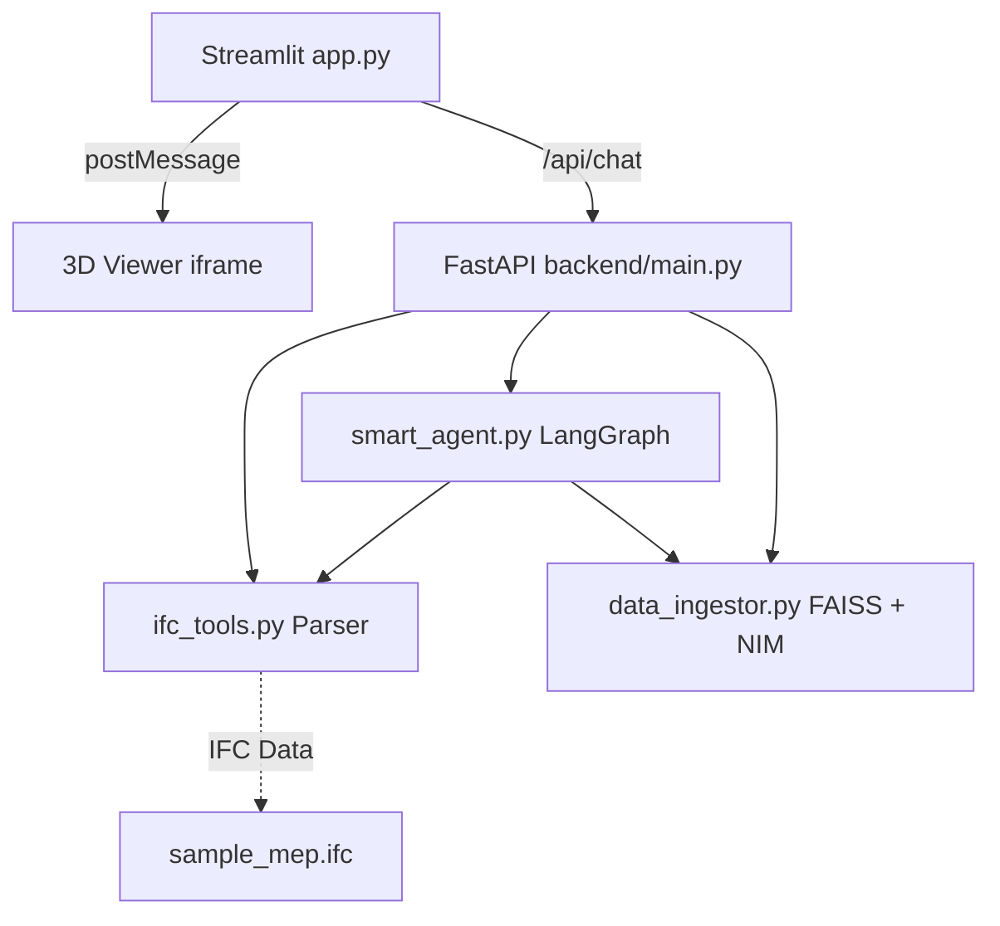

# 🏗️ Digital Twin CMMS

An AI-powered **Computerized Maintenance Management System** that combines a 3D BIM model viewer with a LangGraph ReAct agent for intelligent facility management.

Built with **FastAPI**, **Streamlit**, **LangGraph**, **NVIDIA NIM**, and **IFC.js (ThatOpen Components)**.

---

## ✨ Features

- **3D IFC Model Viewer** — Interactive WebGL rendering of BIM/IFC models using ThatOpen Components (Three.js)
- **AI Chat Assistant** — LangGraph ReAct agent backed by NVIDIA NIM that understands the building model
- **Structured IFC Queries** — Query elements by type, room, system, keyword, or GlobalId — no embeddings needed for the 3D model
- **Document Knowledge Base** — Upload maintenance manuals and specs; the AI indexes them via FAISS + NVIDIA Embeddings for RAG
- **Cross-Frame Highlighting** — Streamlit chat dispatches highlight commands to the 3D viewer iframe via `postMessage`

---

## 🏛️ Architecture



---

## 🚀 Getting Started

### Prerequisites

- Python 3.10+
- [NVIDIA NIM API Key](https://build.nvidia.com/)

### Installation

1. **Clone the repository:**
   ```bash
   git clone https://github.com/ishan-patle/digital-twin-cmms.git
   cd digital-twin-cmms
   ```

2. **Set up virtual environment:**
   ```bash
   python -m venv .venv
   .venv\Scripts\activate        # Windows
   # source .venv/bin/activate   # macOS/Linux
   ```

3. **Install dependencies:**
   ```bash
   pip install -r requirements.txt
   ```

### Configuration

Create a `.env` file in the project root:

```env
NVIDIA_API_KEY="nvapi-your-key-here"
```

### Running

**Terminal 1** — Start the FastAPI backend:
```bash
python -m uvicorn backend.main:app --reload --port 8000
```

**Terminal 2** — Start the Streamlit frontend:
```bash
streamlit run app.py
```

Open **http://localhost:8501** for the full dashboard.

---

## 📁 Project Structure

```bash
digital_twin/
├── app.py                  # Streamlit chat + dashboard frontend
├── backend/
│   ├── __init__.py
│   ├── data_ingestor.py    # FAISS document ingestion & search
│   ├── ifc_tools.py        # IFC model parser & query engine
│   ├── main.py             # FastAPI server (API + static files)
│   ├── smart_agent.py      # LangGraph ReAct agent + tool definitions
│   └── static/
│       ├── app.js           # 3D viewer (Three.js + ThatOpen Components)
│       ├── index.html       # Standalone HTML frontend
│       ├── style.css        # Viewer styles
│       └── viewer.html      # Iframe target for Streamlit
└── data/
    └── sample_mep.ifc      # Sample IFC model (MEP/HVAC)
```

---

## 🚧 Work In Progress

- **WIP 1: 3D Model Highlighting** — Improvement of ExpressID-to-fragment mapping.
- **WIP 2: Robust LangGraph Agents** — Multi-agent orchestration and conversation memory.
- **WIP 3: Bug Fixes & Stability** — Support for large IFC files and reliability.

---

## 🤝 Contributing

Contributions are welcome! Please check the [Issues](https://github.com/ishan-patle/digital-twin-cmms/issues) for planned features and WIP items.

1. Fork the Project
2. Create your Feature Branch (`git checkout -b feature/AmazingFeature`)
3. Commit your Changes (`git commit -m 'Add some AmazingFeature'`)
4. Push to the Branch (`git push origin feature/AmazingFeature`)
5. Open a Pull Request

---

## 📄 License

This project is licensed under the **GNU Affero General Public License v3.0 (AGPL-3.0)**. 

See the [LICENSE](LICENSE) file for details. Any modified version accessible over a network must release its source code under this license.
